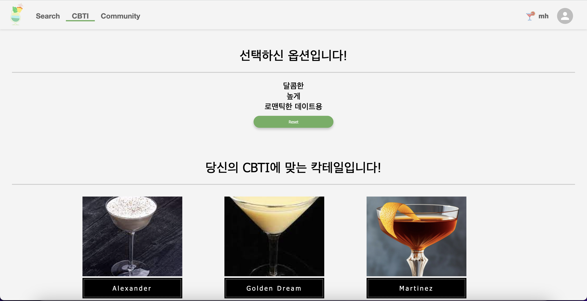
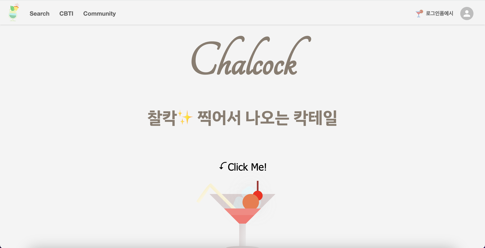

# ChalCock(찰칵)

**찰** 칵 찍어서 나타나는 **칵** 테일 서비스 

## 목차
---
- [팀원](#팀원)
- [Q&A](#Q&A)
- [사용스택](#사용스택)
- [메인화면](#메인화면)
  - [네비게이션바](#네비게이션바)
  - [업로드페이지](#업로드페이지)
    - [도움말버튼](#도움말버튼)
    - [업로드박스](#업로드박스)
  - [CBTI](#CBTI)
    - [옵션 선택](#옵션-선택)
  - [결과페이지](#결과페이지)
  - [칵테일-검색페이지](#칵테일-검색페이지)
    - [칵테일 이름](#칵테일-이름)
    - [주종](#주종)
    - [술-이름](#술-이름)
  - [커뮤니티](#커뮤니티)
  - [회원가입](#회원가입)
  - [로그인](#로그인)
## 팀원
---

---
## Q&A
---
Q. 몇가지의 칵테일 종류가 있나요?
- A. 국제 바텐더 협회(IBA)인증 칵테일 90개 + 국내 후기 가장 많은 칵테일 바 3개에서 판매하는 칵테일 78개 = 총 168개의 칵테일이 있습니다.

Q. 어떤 기능들이 있나요?
- A. 아래의 내용을 참고해주세요.

Q. 술은 몇가지를 인식하나요?
- A. 25개 입니다.

## 사용스택
---
### FrontEnd

- REACT

- JAVASCRIPT

- CSS

- HTML

### BACKEND

- JAVA

- PYTHON

- SPRINGBOOT

- GRADLE

### VISION

- FLASK

- PYTHON

- YOLO

### DB

- Maria DB

- AWS RDS

## 메인화면
---
* 웹서비스에 접속하면 바로 보이는 화면입니다.

* 상단의 Navigation Bar에는 좌측에 로고, Seacrh, CBTI, Commutnity가 있습니다.

* 우측에는 아이콘을 클릭해 회원가입 및 로그인 메뉴가 있습니다.

## 네비게이션바
---
* 먼저 네비게이션바입니다

* 네비게이션바에는 각 페이지로 이동할 수 있는 메뉴 창

* 로고를 클릭하면 홈으로 이동할 수 있는 버튼

* Cocktail Search 메뉴로 이동할 수 있는 SEARCH 버튼

* CBTI 추천을 받을 수 있는 CBTI메뉴

* 커뮤니티 페이지로 이동 가능한 COMMUNITY메뉴

* 우측에는 회원가입 및 로그인이 가능한 아이콘이 있습니다.

## 업로드페이지
---
* 업로드 부분은, 메인화면에 있는 Click Me! 혹은 칵테일 모양의 그림을 클릭하면, 화면 하단의 업로드 기능이 구현된 곳으로 이동합니다.

* 업로드 페이지에는 ?모양의 도움말 버튼, 이미지 업로드 박스, 아래에는 168개의 칵테일 종류가 애니메이션으로 구현되어 있습니다.

> ### 도움말버튼
---
* 도움말 버튼을 클릭하면 다음의 화면이 나타납니다.

* ChalCock 서비스의 사용법이 나타납니다.

* 도움말 화면을 닫을때에는, 아래의 close버튼, 우측 상단의 X버튼, 또는 화면 빈 공간을 클릭해도 닫을 수 있게 구현했습니다.

> ### 업로드박스
---
* 보유한 술을 사진 찍어서 이미지 첨부하는 기능을 가진 업로드 박스입니다.

* 위와 같은 화면에서, 업로드 박스를 클릭하면, 이미지 업로드 할 수있는 창이 나타나고, 사진을 업로드 하면 됩니다.

* 그러면 다음과 같이 로딩페이지가 나타나며

* 다음과 같이 사진의 술을 인식 후 사진의 술로 만들 수 있는 칵테일을 추천해줍니다.

* 추천 칵테일 페이지에는 칵테일 한글명, 영문명, 인식한 술의 종류, 인식한 술의 이름, 재료, 가니쉬(장식), 제조법이 나타납니다.

* 추천 칵테일은 한번의 리스트에 8개까지 구현했으며, 각각 이미지를 클릭하면 해당하는 사진의 맞는 정보가 표시됩니다.

* 또한 8개가 넘는 결과가 나오면, next버튼으로 다음 페이지도 볼 수 있으며, prev버튼을 통해 이전의 페이지로 이동할 수도 있습니다.

* 모델에 없는 종류의 술을 업로드 하면, 다음과 같이 인식 할 수 없다는 경고창이 나타납니다.

## CBTI
---
* 칵테일 입문자를 위한 3가지 질문을 통해 질문에 맞는 선호도에 따라 칵테일을 추천해주는 시스템입니다.

> ### 옵션 선택

* 질문에 해당하는 옵션을 클릭하면 다음과 같이 주황색으로 체크되면서, 다음 질문으로 넘어갑니다.

* 질문은 다음과 같이 두가지가 더 있습니다.

> ### 결과페이지

* 선택한 옵션에 따른 결과는 다음처럼 나타납니다.

* 더 많은 결과가 나타나면 스크롤을 통해 아래로 내릴 수 있습니다.

* 선택한 옵션 아래에 있는 Reset 버튼을 누르면, 옵션이 초기화 되면서 맨 처음 질문으로 돌아갑니다.

## 칵테일 검색페이지
---
* 칵테일 검색페이지의 초기 화면은 다음과 같습니다.

* 칵테일 검색페이지에서는 총 3개의 카테고리를 통해 검색할 수 있습니다.

- 술이름
- 주종
- 칵테일이름

* 술 이름은 술 병에 적혀있는 이름을 나타냅니다. 예를들면 앱솔루트보드카, 피치트리 등이 있습니다.

* 주종은 술 이름의 분류를 의미합니다. 예를들어 앱솔루트 보드카라면 보드카, 헤네시XO라면 코냑등이 있습니다.

* 칵테일 이름은 칵테일의 이름입니다. 모히토, 좀비등이 있습니다.

> ### 칵테일 이름
---
* 먼저 칵테일 이름 카테고리입니다.

* 칵테일 이름은 영문으로 입력해도 인식하고, 한글로 입력해도 인식해서 나타납니다.

* 또 나타난 결과 카드 목록에서, 마우스를 카드 위로 올리면 해당하는 칵테일의 재료를 카드 뒷면으로 뒤집어서 보여줍니다.

* 추가로 제조법, 가니쉬 등의 정보를 확인하고 싶다면 뒤집힌 카드를 클릭하면 팝업으로 보여줍니다.

> ### 주종
---
* 다음은 주종 카테고리입니다.

* 주종 카테고리는 술의 분류에 해당하는 이름을 입력하면 그에 맞는 결과를 검색해 보여줍니다.

> ### 술 이름
---
* 다음은 술 이름 카테고리입니다.

* 술 이름 카테고리는 술의 판매명을 입력하면 그에 맞는 결과를 검색해 보여줍니다.

## 커뮤니티
---
* 다음은 커뮤니티 페이지입니다.

* 글을 클릭하면 글의 내용을 확인할 수 있습니다.
* 아래에 댓글도 추가할 수 있으며, 작성자만 글과 댓글을 삭제 및 수정이 가능합니다.
* 작성한 댓글 및 게시글은 작성한 날짜와 작성자가 표시됩니다.

* 게시판의 모든 글과 댓글은 회원가입 후 로그인 한 사용자만 작성이 가능합니다.
* 로그인 하지 않으면 작성할 수 없다는 경고문이 나타납니다.

* 게시글은 글쓰기 버튼을 누르고 난 후 다음의 업로드 양식에 따라 글을 작성할 수 있습니다.

* 다음처럼 이름, 내용, 작성자에 따라 카테고리를 선택 후 검색할 수 있습니다

## 회원가입
---
* 다음은 회원가입 페이지입니다.

* 회원가입에는 ID와 닉네임을 중복검사하는 버튼이 있으며, 버튼을 클릭해 중복검사를 해야지 가입이 가능합니다.

* 미검사시 다음과 같이 중복검사를 실시하라는 알림이 나타납니다.

* ID와 닉네임을 중복 검사 후 중복되면 다음과 같은 알림이 나타납니다.

* ID와 닉네임 중복 검사 후 중복되지 않으면 다음과 같이 가입이 가능하다는 알림이 나타납니다.

* 회원가입 진행 중에 비밀번호 입력란과 비밀번호 확인란의 입력한 값이 다르면, 입력 값이 다르다는 문구가 나타납니다.

* 일치하면 사라집니다

* 모든 절차 완료 후 제출 버튼을 누르면 가입이 완료됩니다.

## 로그인
---
* 다음은 로그인 페이지입니다.

* 로그인을 완료하면, 다음과 같이 로그인 됩니다.

